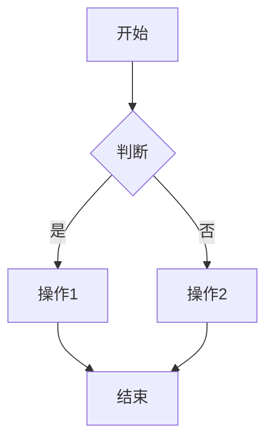

# Markdown to HTML Converter

这是一个基于 Node.js 的命令行工具，用于将 Markdown 文件转换为功能丰富的、独立的 HTML 文件。它集成了代码高亮、图表渲染和灵活的样式控制，非常适合用于生成文档、报告或静态页面。

## 功能特性

- **Markdown 转换**: 使用 [Showdown.js](https://github.com/showdownjs/showdown) 将 Markdown 解析为 HTML。
- **GitHub 风格**: 完全支持 GitHub Flavored Markdown (GFM)，包括表格、任务列表、删除线等。
- **代码语法高亮**: 使用 [highlight.js](https://highlightjs.org/) 自动为代码块提供语法高亮。
- **Mermaid 图表渲染**: 支持在 Markdown 中直接编写 Mermaid 语法来生成流程图、序列图、饼图等，并自动居中显示。
- **灵活的图片样式**:
  - 图片默认保持原始尺寸，但不会超出页面宽度。
  - 可通过辅助类轻松将图片设置为**居中**或**占满宽度**。
- **样式化**: 输出的 HTML 包含默认的 CSS 样式 (`style.css`)，具有良好的可读性，并且易于定制。
- **批量处理**: 支持转换单个 Markdown 文件或整个目录中的所有 `.md` 文件。
- **命令行界面**: 提供清晰的命令行参数，方便集成和自动化。

## 系统必备

- [Node.js](https://nodejs.org/) (推荐 LTS 版本)
- npm (通常随 Node.js 一起安装)

## 安装与设置

1.  **克隆或下载项目**: 将 `convert.js`, `style.css`, 和 `md_html.cmd` 文件放置在同一个目录下。

2.  **安装依赖**: 在项目目录下打开终端，运行以下命令来安装所需的 Node.js 模块。

    ```bash
    npm install showdown highlight.js yargs
    ```
    这将在当前目录下创建一个 `node_modules` 文件夹和一个 `package.json` 文件。

## 文件结构

- `convert.js`: 核心转换脚本，包含所有处理逻辑。
- `style.css`: 用于美化输出 HTML 的默认层叠样式表。
- [cite_start]`md_html.cmd`: 一个便捷的 Windows 批处理脚本，用于从命令行运行转换器。 [cite: 1]
- `node_modules/`: 存放已安装的 Node.js 依赖项。

## 使用方法

你可以通过 `node` 命令直接运行脚本，也可以在 Windows 环境下使用 `md_html.cmd` 批处理文件。

### 命令行参数

脚本通过 `yargs` 解析命令行参数，提供了丰富的选项：

- `-i, --input <路径>`: **(必需)** 指定输入的 Markdown 文件或目录。
- `-o, --output <路径>`: `(可选)` 指定输出 HTML 文件的目录。如果未提供，则输出到源文件所在目录。
- `-t, --title <文本>`: `(可选)` 设置生成 HTML 页面的 `<title>`。默认为输入文件的文件名。
- `-d, --domain <域名>`: `(可选)` 为 [Plausible Analytics](https://plausible.io/) 指定域名。
- `-s, --style <路径>`: `(可选)` 指定一个自定义基础 CSS 样式文件的路径。默认为 `style.css`。
- `-hs, --highlight-style <路径>`: `(可选)` 指定一个自定义 highlight.js 主题样式文件的路径。默认为 `atom-one-dark.css`。

### 示例

#### 转换单个文件

```bash
node convert.js -i "path/to/your/document.md" -o "path/to/output"
```

#### 转换整个目录

```bash
node convert.js -i "path/to/markdown_folder/"
```

#### 使用 Windows 批处理文件

[cite_start]`md_html.cmd` 会将所有参数直接传递给 Node.js 脚本 [cite: 1]。

```cmd
md_html.cmd -i "my_doc.md"
```

## Markdown 编写指南

为了充分利用此工具的功能，请遵循以下指南。

### 代码块

使用标准的 Markdown 围栏代码块，并指定语言标识符以获得正确的语法高亮。

**示例:**
````markdown
```javascript
function greet() {
  console.log("Hello, world!");
}
```
`````

### Mermaid 图表

将图表定义包裹在 `mermaid` 语言标识符的代码块中。图表在页面上将自动居中显示。

**示例:**

````markdown

````

### 图片样式

你可以灵活控制图片的显示方式。

1.  **默认行为 (原始尺寸, 不超宽)**
    使用标准 Markdown 语法。图片将保持其原始尺寸，但如果宽度超过页面内容区域，会自动缩小以适应。

    ```markdown
    
    ```

2.  **居中显示**
    将标准的 Markdown 图片语法包裹在一个带有 `center` 类的 `<div>` 中。

    ```markdown
    <div class="center">
    
    </div>
    ```

3.  **占满宽度**
    直接使用 HTML 的 `` 标签，并添加 `img-full-width` 类。

    ```markdown
    
    ```

## 定制化

你可以通过以下方式轻松定制输出样式：

1.  **修改 `style.css`**: 直接编辑 `style.css` 文件 以更改颜色、字体、间距等。
2.  **使用自定义样式表**: 通过 `--style` 和 `--highlight-style` 参数在运行时指定自己的 CSS 文件路径。
